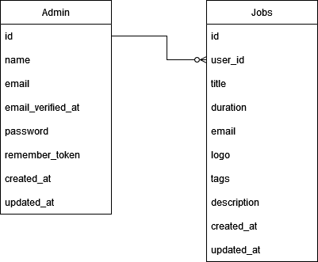

# **DPTSI IT Jobs**: Laravel Final Project (Midterm Exam) PBKK (D) 🚀

<strong>IT Jobs</strong>

## Tabel Konten

- [Anggota Kelompok](#anggota-kelompok)
- [Tentang Project](#tentang-project)
- [Desain Database](#desain-database)

## Anggota Kelompok

<table>
    <thead>
        <tr>
            <th>Nama</th>
            <th>NRP</th> 
        </tr>
    </thead>
    <tbody>
        <tr>
            <td>Yehezkiel Wiradhika</td>
            <td>5025201086</td>
        </tr>
        <tr>
            <td>Samuel Berkat Hulu</td>
            <td>5025201055</td>
        </tr>
    </tbody>
</table>

## Tentang Project

Project ini merupakan list berbagai pekerjaan IT yang tersedia di DPTSI ITS. Project ini dibangun menggunakan Laravel serta Vuejs yang menggunakan Tailwindcss sebagai framework CSS.

  

## Desain Database

**Deskripsi**

Terdapat 2 tabel dalam database, yakni admin dan jobs (pekerjaan) yang terelasi dengan user_id dimana mereka memiliki hubungan one (admin) to many (jobs)

**Tabel Database**

- Database admin
- Database jobs

**Desain diagram database**

**Teknologi Database**

Teknologi database yang digunakan ialah MySQL dengan menggunakan XAMPP untuk server local database

